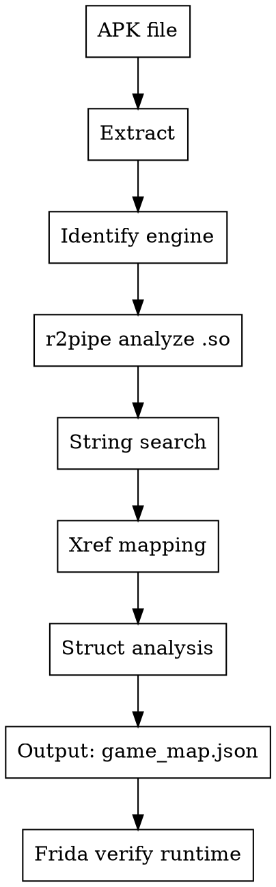

# APK Recon - Automated Static Analysis Pipeline

## Overview
Automatically extract and analyze a game APK to build a "game map" of functions, strings, structs, and offsets BEFORE touching the running game. Output guides Frida hooking and pointer chain discovery.

## When to Use
- Have APK file, starting RE on new game
- Want to know game engine, networking, struct layout before runtime
- Need to narrow down where to hook/scan instead of blind searching
- Before using frida-memory-scan or pointer-chain-finder skills

## Pipeline Flow



## Phase 1: Extract APK

```python
import zipfile, os, json

def extract_apk(apk_path, out_dir):
    with zipfile.ZipFile(apk_path, 'r') as z:
        z.extractall(out_dir)

    # Find native libs
    libs = {}
    for root, dirs, files in os.walk(out_dir):
        for f in files:
            if f.endswith('.so'):
                arch = os.path.basename(root)  # x86, armeabi-v7a, etc
                libs.setdefault(arch, []).append(os.path.join(root, f))

    # Find assets (Lua scripts, configs)
    assets = []
    assets_dir = os.path.join(out_dir, 'assets')
    if os.path.exists(assets_dir):
        for root, dirs, files in os.walk(assets_dir):
            for f in files:
                if f.endswith(('.lua', '.luac', '.json', '.xml', '.cfg', '.dat')):
                    assets.append(os.path.join(root, f))

    return libs, assets
```

## Phase 2: Identify Engine

```python
ENGINE_SIGNATURES = {
    'libcocos2dlua.so': 'Cocos2d-x + Lua',
    'libcocos2dcpp.so': 'Cocos2d-x C++',
    'libil2cpp.so': 'Unity IL2CPP',
    'libunity.so': 'Unity Mono',
    'libCore.so': 'Flash/AIR',
    'libgdx.so': 'LibGDX',
    'libue4.so': 'Unreal Engine 4',
    'libxlua.so': 'Unity + xLua',
}

def identify_engine(libs):
    for arch, files in libs.items():
        for f in files:
            name = os.path.basename(f)
            if name in ENGINE_SIGNATURES:
                return ENGINE_SIGNATURES[name], f, arch
    return 'Unknown', None, None
```

### Engine-specific targets

| Engine | Main .so | Key strings | Value type |
|--------|----------|-------------|------------|
| Cocos2d-x + Lua | libcocos2dlua.so | `tolua_`, `lua_`, `Scene`, `Layer` | Float 32-bit |
| Unity IL2CPP | libil2cpp.so | `il2cpp_`, class/method names in `global-metadata.dat` | Float/Double |
| Flash/AIR | libCore.so | `ActionScript`, `avmplus` | Double 64-bit |
| Unity + xLua | libil2cpp.so + libxlua.so | `xlua_`, `LuaEnv` | Float/Double |

## Phase 3: Automated r2pipe Analysis

```python
import r2pipe, json

# Game-related keyword categories
KEYWORDS = {
    'player': ['Player', 'Hero', 'Character', 'Self', 'KPlayer', 'CPlayer'],
    'position': ['Position', 'Coord', 'PosX', 'PosY', 'Location', 'Move', 'Walk', 'Path'],
    'combat': ['HP', 'MP', 'Attack', 'Defense', 'Damage', 'Skill', 'Battle', 'Fight'],
    'inventory': ['Item', 'Inventory', 'Bag', 'Equip', 'UseItem', 'KItem'],
    'quest': ['Quest', 'Mission', 'Task', 'NPC', 'Dialog', 'Accept', 'Submit'],
    'network': ['Send', 'Recv', 'Packet', 'Socket', 'Connect', 'Protocol', 'Msg'],
    'economy': ['Gold', 'Money', 'Coin', 'Shop', 'Buy', 'Sell', 'Trade'],
    'map': ['Map', 'Scene', 'Stage', 'Level', 'Teleport', 'Transport'],
    'login': ['Login', 'Logout', 'Account', 'Auth', 'Token', 'Session'],
}

def analyze_binary(so_path):
    r2 = r2pipe.open(so_path)
    r2.cmd("aa")  # Basic analysis (use "aaa" for small files <5MB)

    results = {
        'exports': [],
        'strings': {},
        'functions': {},
        'xrefs': {},
    }

    # 1. Exports - named functions
    exports = json.loads(r2.cmd("iEj") or "[]")
    for exp in exports:
        name = exp.get('name', '')
        for category, keywords in KEYWORDS.items():
            if any(kw.lower() in name.lower() for kw in keywords):
                results['exports'].append({
                    'name': name,
                    'addr': hex(exp.get('vaddr', 0)),
                    'category': category
                })
                break

    # 2. Strings search
    all_strings = json.loads(r2.cmd("izj") or "[]")
    for s in all_strings:
        text = s.get('string', '')
        addr = hex(s.get('vaddr', 0))
        for category, keywords in KEYWORDS.items():
            if any(kw.lower() in text.lower() for kw in keywords):
                results['strings'].setdefault(category, []).append({
                    'text': text,
                    'addr': addr
                })
                break

    # 3. Xref: string -> function that uses it
    for category, strings in results['strings'].items():
        for s in strings[:20]:  # Top 20 per category
            xrefs = r2.cmd("axt " + s['addr'])
            if xrefs.strip():
                for line in xrefs.strip().split('\n'):
                    parts = line.split()
                    if len(parts) >= 2:
                        func_addr = parts[1]
                        # Get function name at this address
                        func_info = r2.cmd("afi. @ " + func_addr)
                        results['xrefs'].setdefault(category, []).append({
                            'string': s['text'],
                            'ref_addr': func_addr,
                            'function': func_info.strip().split('\n')[0] if func_info.strip() else 'unknown'
                        })

    # 4. Function search by name pattern
    func_list = r2.cmd("afl")
    for category, keywords in KEYWORDS.items():
        for kw in keywords:
            matches = [l for l in func_list.split('\n') if kw.lower() in l.lower()]
            for m in matches[:10]:
                parts = m.split()
                if len(parts) >= 4:
                    results['functions'].setdefault(category, []).append({
                        'addr': parts[0],
                        'name': parts[-1],
                        'size': parts[2] if len(parts) > 2 else '?'
                    })

    r2.quit()
    return results
```

## Phase 4: IL2CPP Metadata (Unity games only)

```python
def parse_il2cpp_metadata(extracted_dir):
    metadata_path = os.path.join(extracted_dir, 'assets', 'bin', 'Data', 'Managed', 'Metadata', 'global-metadata.dat')
    if not os.path.exists(metadata_path):
        return None

    # Use il2cppdumper output if available, or parse header
    # il2cppdumper generates dump.cs with all class/method/field names
    # This gives FULL struct layout without runtime analysis
    return metadata_path
```

For Unity IL2CPP: run `il2cppdumper` separately to get `dump.cs` with all class definitions, field offsets, method addresses.

## Phase 5: Output game_map.json

```python
def build_game_map(apk_path, output_dir):
    extract_dir = os.path.join(output_dir, 'extracted')
    extract_apk(apk_path, extract_dir)

    libs, assets = extract_apk(apk_path, extract_dir)
    engine, main_so, arch = identify_engine(libs)

    game_map = {
        'engine': engine,
        'arch': arch,
        'main_so': os.path.basename(main_so) if main_so else None,
        'assets': [os.path.basename(a) for a in assets],
        'analysis': None
    }

    if main_so:
        game_map['analysis'] = analyze_binary(main_so)

    # Summary: prioritized hook targets
    game_map['hook_targets'] = prioritize_targets(game_map['analysis'])

    output_path = os.path.join(output_dir, 'game_map.json')
    with open(output_path, 'w') as f:
        json.dump(game_map, f, indent=2, ensure_ascii=False)

    return game_map

def prioritize_targets(analysis):
    if not analysis:
        return []
    targets = []

    # Priority 1: Network functions (SendMsg, ProcessPacket)
    for f in analysis.get('functions', {}).get('network', []):
        targets.append({'priority': 1, 'type': 'hook', 'category': 'network', **f})

    # Priority 2: Player struct access (position, HP)
    for f in analysis.get('functions', {}).get('player', []):
        targets.append({'priority': 2, 'type': 'hook', 'category': 'player', **f})

    # Priority 3: Item/inventory functions
    for f in analysis.get('functions', {}).get('inventory', []):
        targets.append({'priority': 3, 'type': 'hook', 'category': 'inventory', **f})

    targets.sort(key=lambda x: x['priority'])
    return targets
```

## Phase 6: Connect to Existing Skills

```
apk-recon output (game_map.json)
    |
    +-- hook_targets[network] --> frida-packet-reverse skill
    |     Hook send/recv at known addresses
    |
    +-- hook_targets[player] --> frida-memory-scan skill
    |     Scan near known struct offsets
    |
    +-- found addresses --> pointer-chain-finder skill
    |     Build stable chains
    |
    +-- all combined --> game-bot-builder skill
          Build full bot
```

### Using game_map to guide Frida scan

```javascript
// game_map says: KPlayer::GetPosX at 0x123456
// Hook it to get player pointer, then probe struct
Interceptor.attach(base.add(0x123456), {
    onEnter: function(args) {
        // args[0] = this = KPlayer pointer
        var player = args[0];
        // Probe around for position values
        for (var off = 0; off < 0x200; off += 4) {
            var val = player.add(off).readFloat();
            if (val > 0 && val < 10000) {
                console.log('+0x' + off.toString(16) + ' = ' + val);
            }
        }
    }
});
```

## Quick Reference

| Step | Tool | Output |
|------|------|--------|
| Extract APK | zipfile | .so files, assets |
| Identify engine | filename match | Engine type, main .so |
| Analyze binary | r2pipe | strings, exports, functions, xrefs |
| IL2CPP metadata | il2cppdumper | Full class/method/field layout |
| Build game map | Python | game_map.json with prioritized targets |
| Verify runtime | Frida | Confirm addresses, read values |

## Common Mistakes

| Mistake | Fix |
|---------|-----|
| Run `aaa` on 20MB+ .so | Use `aa` then targeted `af` on specific functions |
| Only check x86 libs | Check armeabi-v7a too — may have different exports |
| Ignore assets folder | Lua scripts, configs reveal game logic without disasm |
| Skip IL2CPP metadata | `dump.cs` gives ALL struct layouts for free |
| Trust static offsets blindly | Always verify with Frida at runtime — ASLR, versions differ |
| Analyze everything | Focus on KEYWORDS categories, skip unrelated functions |
