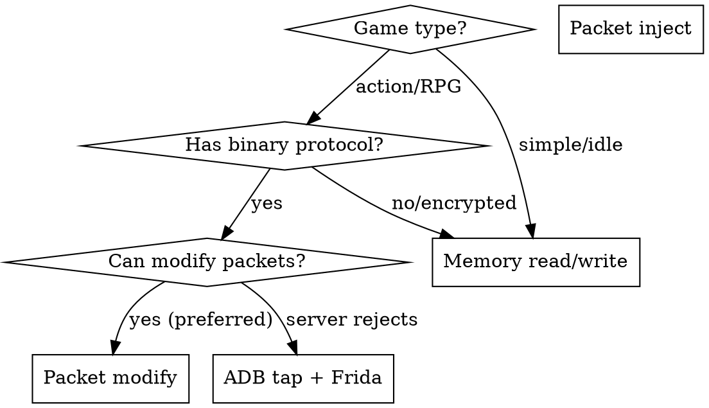

# Game Bot Builder

## Overview
End-to-end workflow for building a fully automated bot for a mobile game on Android emulator. Combines all reverse engineering skills into a structured approach.

## When to Use
- Starting a new game bot from zero
- User says "lam bot cho game X" or "auto game X"
- Need structured approach instead of ad-hoc exploration

## Decision: Which approach?



**Priority order:**
1. **Packet modify** — safest, server handles state
2. **Memory read + packet inject** — full control but server may reject
3. **Memory read/write** — direct but risk detection
4. **ADB tap + Frida monitor** — fallback, slow but reliable

## Phase 1: Reconnaissance (Day 1)

### 1.1 Identify game tech stack

```bash
# Extract APK
adb pull /data/app/com.game.package/base.apk game.apk
unzip game.apk -d game_extracted/

# Check engine
ls game_extracted/lib/armeabi-v7a/   # or x86/
# libcocos2d.so -> Cocos2d-x
# libil2cpp.so -> Unity IL2CPP
# libCore.so -> Flash/AIR
# libgdx.so -> LibGDX

# Check for Lua/scripts
ls game_extracted/assets/
# src/ -> Lua scripts (Cocos2d-x)
# scripts/ -> game logic
```

### 1.2 Static analysis with r2pipe

**REQUIRED:** Use r2-static-analysis skill.

```python
import r2pipe
r2 = r2pipe.open("libgame.so")
r2.cmd("aa")

# Find networking
r2.cmd("afl~[Ss]end")
r2.cmd("afl~[Rr]ecv")
r2.cmd("afl~[Pp]rocess")
r2.cmd("afl~[Pp]acket")

# Find game logic
r2.cmd("iz~Quest")
r2.cmd("iz~Battle")
r2.cmd("iz~Login")
r2.cmd("iz~Player")
```

### 1.3 Passive packet capture

**REQUIRED:** Use frida-packet-reverse skill.

Hook send/recv, do NOT modify anything. Just log and correlate with UI actions.

## Phase 2: Protocol Analysis (Day 1-2)

### 2.1 Map packet structure
- Identify magic bytes, header layout, cmd byte offset
- Build cmd table by performing each game action manually

### 2.2 Map game flow
```
Login sequence:    S cmd1 -> R cmd2 -> S cmd3 -> R cmd4 (OK)
Battle flow:       R turn -> R wind -> R enemy_move -> S shoot -> S turn_ack
Quest flow:        S accept -> R quest_data -> S submit -> R reward
```

### 2.3 Identify critical packets
- Which packets contain positions? (player, enemy, NPC)
- Which packets trigger actions? (move, attack, use item)
- Which packets indicate state? (turn, battle start/end, dialog)

## Phase 3: Memory Mapping (Day 2-3)

### 3.1 Find key addresses

**REQUIRED:** Use frida-memory-scan skill.

Priority values to find:
1. Player position (x, y)
2. Player HP/MP
3. Inventory/items
4. Target/enemy position
5. Game state (in battle, in town, etc.)

### 3.2 Build pointer chains

**REQUIRED:** Use pointer-chain-finder skill.

Only for values that need to persist across restarts.

### 3.3 Build Frida RPC agent

```javascript
// agent.js - expose game data via RPC
rpc.exports = {
    readCoords: function() {
        var base = Process.getModuleByName('libgame.so').base;
        var ptr1 = base.add(OFFSET1).readPointer();
        var ptr2 = ptr1.add(OFFSET2).readPointer();
        return {
            x: ptr2.add(OFF_X).readDouble(),
            y: ptr2.add(OFF_Y).readDouble()
        };
    },
    readHP: function() { /* ... */ },
    useItem: function(itemId) { /* build + send packet */ },
    moveTo: function(x, y) { /* build + send move packet */ }
};
```

## Phase 4: Bot Logic (Day 3-4)

### 4.1 Python wrapper

```python
import frida

session = device.attach(pid)
script = session.create_script(open('agent.js').read())
script.load()
api = script.exports_sync

# Main loop
while running:
    coords = api.read_coords()
    hp = api.read_hp()

    if hp < 50:
        api.use_item(HP_POTION_ID)
    elif has_quest:
        api.move_to(quest_npc_x, quest_npc_y)
        api.dialog_npc(npc_id)
    # ...
```

### 4.2 State machine

```python
class BotState:
    IDLE = 'idle'
    MOVING = 'moving'
    IN_BATTLE = 'battle'
    IN_DIALOG = 'dialog'
    QUEST = 'quest'

# Detect state from memory/packets
# Execute actions based on state
# Handle transitions and errors
```

## Phase 5: Multi-Account & Hardening

- Account list management (login/logout cycle)
- Error recovery (crash detection, auto-restart)
- Rate limiting (avoid detection)
- Logging and statistics

## Common Mistakes

| Mistake | Fix |
|---------|-----|
| Jump straight to coding | Spend day 1 on recon and passive capture |
| Inject packets first | Try modifying existing packets first |
| No error recovery | Game WILL crash. Build retry logic from start |
| Hardcode offsets | Use pointer chains for persistence |
| Skip r2 analysis | Static analysis reveals function names, strings, structure |
| One approach only | If packet inject fails, try memory write or ADB tap |

## Project Structure

```
D:\Code Tools\GameName\
  scripts/
    agent.js          # Frida JS agent (all game interaction)
  core/
    frida_manager.py  # Frida session management
    adb.py            # ADB controller
  game/
    state.py          # Game state reader
    player.py         # Player actions
  tasks/
    main_loop.py      # Bot logic
  config.json         # Paths, offsets, settings
  main.py             # Entry point
```
